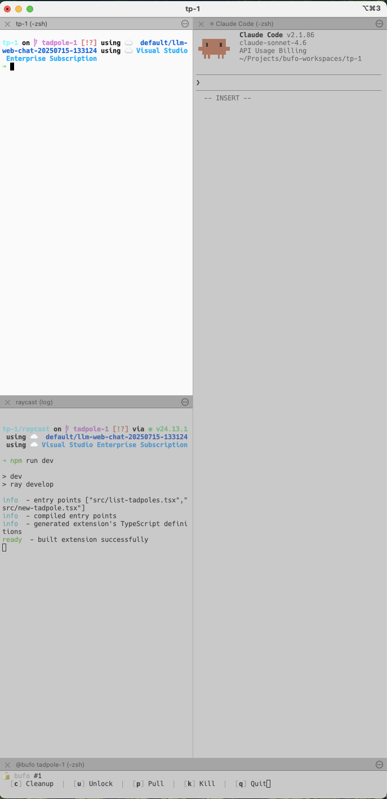

# bufo 

An iTerm2-native workspace (tadpoles) manager for multi-repo development on macOS. 

Each tadpole is a **git worktree** with its own branch. Opening a tadpole creates an iTerm2 window/tab with 3 panes (terminal, server, main) and runs configured commands in each.



## Install

### Prerequisites

- **macOS** (iTerm2 is macOS only)
- **[Homebrew](https://brew.sh)** — used to install dependencies
- **[iTerm2](https://iterm2.com)** — install before running the command below

### One-line install

```bash
curl -fsSL https://github.com/Ebonsignori/bufo/releases/latest/download/install.sh | bash
```

This installs `bufo`, installs required dependencies (`git`, `yq`, `jq` via Homebrew), adds `~/.local/bin` to your PATH, and walks you through configuring iTerm2 (keyboard shortcuts, clipboard paste, session logging, and the web daemon). The installer will also offer to install the [Raycast extension](#raycast-extension) if Raycast is detected.

To skip the iTerm2 setup step:

```bash
curl -fsSL https://github.com/Ebonsignori/bufo/releases/latest/download/install.sh | bash -s -- --no-setup
```

<details>
<summary>What's skipped with <code>--no-setup</code></summary>

| Feature | Without setup | Impact |
|---|---|---|
| **Pane navigation keybindings** (`Ctrl+H/J/K/L`) | Not configured in iTerm2 | Can't keyboard-navigate between panes; bufo's AppleScript control still works fine |
| **Clipboard image paste** (`Cmd+Shift+V`) | Not installed | `Cmd+Shift+V` won't convert clipboard images to file paths for AI agents |
| **iTerm2 session logging** | Not enabled on profiles | `bufo web` mobile UI falls back to plaintext polling instead of full ANSI color rendering |
| **Web daemon LaunchAgent** | Not installed | `bufo web start` / `bufo web restart` will error; daemon won't auto-start at login |
| `setup_completed` config flag | Not written | Every bufo command prints a reminder tip until setup is run |

Run `bufo install` at any time to complete the setup retroactively.

</details>

If you have the repo cloned locally, you can also run the installer directly — it will use the local files instead of downloading from GitHub:

```bash
./install.sh
```

### TypeScript CLI

Bufo is being migrated to TypeScript. The new `bufo-ts` binary is available alongside the original bash CLI:

```bash
# Build the TypeScript packages
make build

# Run via the TS entry point directly
npx bufo-ts --version

# Or via node
node packages/cli/dist/index.js --version
```

Both `bufo` (bash) and `bufo-ts` (TypeScript) are available during the migration. The TypeScript version will eventually replace the bash CLI entirely.

## Quick Start

```bash
# 1. Open a new terminal (or source your shell profile) so 'bufo' is on PATH
source ~/.zshrc

# 2. Register a project
bufo init

# 3. Open tadpole 1 (creates iTerm2 window with 3 panes)
bufo 1

# List tadpoles
bufo

# Restart current tadpole
bufo restart
```

> **Note:** The TypeScript CLI (`bufo-ts`) supports a subset of commands and is under active development. Use `bufo` (bash) for full functionality.

## Quick Open

Paste any GitHub or Linear URL directly — bufo auto-detects it and opens an unlocked tadpole, or reopens the existing one if it's already assigned to that PR or ticket:

```bash
bufo https://github.com/owner/repo/pull/42       # GitHub PR
bufo https://github.com/owner/repo/issues/42     # GitHub Issue
bufo https://linear.app/myteam/issue/ENG-123/... # Linear ticket
```

## Commands

### Tadpoles

```bash
bufo tp               # Interactive menu
bufo tp <N>           # Open/create tadpole N
bufo spawn            # Create next available tadpole
bufo tp <N> restart   # Reset git + recreate panes
bufo tp <N> cleanup   # Close window + reset to origin/main
bufo tp <N> destroy   # Remove tadpole completely
bufo tp <N> continue  # Resume with --continue flag
```

### Shortcuts (auto-detect tadpole from cwd)

```bash
bufo <N>              # Shorthand for: bufo tp <N>
bufo restart          # Restart current tadpole
bufo cleanup          # Cleanup current tadpole
bufo continue         # Continue current tadpole
```

### WIP (Work in Progress)

```bash
bufo wip save              # Save current changes (branch, commits, patches)
bufo wip save --restart    # Save then restart tadpole
bufo wip ls                # List all WIPs globally
bufo wip restore           # Interactive restore
bufo wip restore <N>       # Restore WIP #N
bufo wip --continue        # Restore most recent WIP
```

### Sessions

```bash
bufo session ls            # List sessions
bufo session start "name"  # Start new session
bufo session resume "name" # Resume session
```

### Reviews

```bash
bufo review <PR>           # Quick review (number, repo#num, or URL)
bufo review new            # Interactive multi-PR review
bufo chorus <PR>           # Thorough multi-agent review
```

### Tickets

```bash
bufo ticket ENG-123                                               # Linear ticket ID
bufo ticket https://linear.app/myteam/issue/ENG-123/fix-the-bug  # Linear ticket URL
bufo ticket https://github.com/owner/repo/issues/42              # GitHub Issue URL
bufo tp 3 ticket ENG-123                                          # Use specific tadpole
```

### Opening a PR

```bash
bufo review 42                                      # PR number (uses current project's repo)
bufo review myrepo#42                               # PR from a specific repo
bufo review https://github.com/owner/repo/pull/42  # Full GitHub PR URL
```

### Multi-Project

```bash
bufo init                  # Register a project
bufo @alias tp 1           # Run command for specific project
bufo projects              # List registered projects
bufo default <alias>       # Set default project
```

### Other

```bash
bufo config                # Show configuration
bufo config scan           # Auto-detect .env files and ports
bufo doctor                # Diagnose issues
bufo ports                 # Show port usage
bufo raycast install       # Install the Raycast extension
bufo raycast dev           # Start Raycast extension in dev/hot-reload mode
bufo cheat                 # Full cheat sheet
```

### Companion Repos

Keep one canonical clone of a shared repo (e.g. an internal monorepo) alongside your worktrees and symlink it into each tadpole automatically — no duplication.

```bash
bufo companions                    # Show status of all companions
bufo companions sync               # Symlink companions into all existing tadpoles
bufo companions sync --replace     # Replace existing dirs with symlinks
bufo companions fetch              # git fetch in each canonical clone
```

Configure in your project YAML:

```yaml
companions:
  repos:
    - name: github
      remote: git@github.com:github/github.git
    - name: translations
      remote: ""       # no auto-clone; symlink if already present
      link_as: translations  # optional, defaults to name
```

Companion clones live at `$tadpole_base/<name>` (alongside `tp-1…tp-N`, not inside them). On each tadpole create or open, bufo clones any missing companions and symlinks them in. Symlink names are added to `.git/info/exclude` so they never show up in `git status`.

## Raycast Extension

Bufo includes a [Raycast](https://raycast.com) extension with commands for managing tadpoles and sessions without leaving the keyboard:

| Command | Description |
|---|---|
| **List Tadpoles** | Browse all tadpoles across projects — focus, open, lock/unlock, cleanup, destroy |
| **New Tadpole** | Create a tadpole from a ticket/PR URL or slot number |
| **List Sessions** | Browse all sessions — resume, focus, delete |
| **New Session** | Start a new named session |
| **New Main Tadpole** | Open the main repo checkout directly (no worktree) |

### Install

The installer offers to install the extension automatically. To install or update manually:

```bash
bufo raycast install   # Copy pre-built extension to Raycast (no npm required)
```

To start the extension with hot-reload for development (requires npm and the `ray` CLI):

```bash
bufo raycast dev
```

## Configuration

Config files live at `~/.bufo/projects/<alias>.yaml`:

```yaml
session_name: myproject
tadpole_base: ~/Projects/myproject-tadpoles
main_repo: ~/Projects/myproject

tadpoles:
  prefix: tp
  branch_pattern: tadpole-{N}

layout:
  panes:
    - name: terminal
      command: ""
    - name: server
      command: "npm run dev"
    - name: main
      command: "claude --dangerously-skip-permissions"

env_sync:
  port_spacing: 10
  files:
    - path: .env
      ports: [PORT]
```

## How It Works

Each tadpole is a **git worktree** with its own branch. When you open a tadpole, bufo:

1. Creates the worktree (if needed)
2. Opens an iTerm2 window/tab with 3 panes (terminal, server, main)
3. Runs configured commands in each pane
4. Syncs `.env` files with unique ports per tadpole

Tadpole state (iTerm2 session IDs) is persisted at `~/.bufo/state/` so bufo can reconnect to existing panes.

## License

MIT
